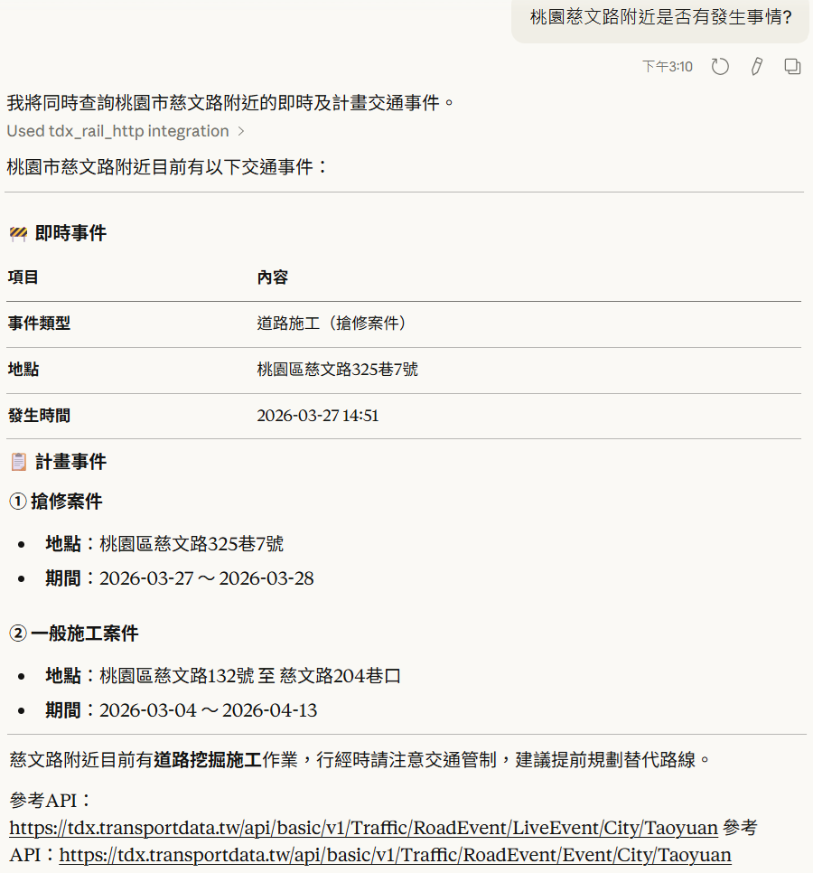
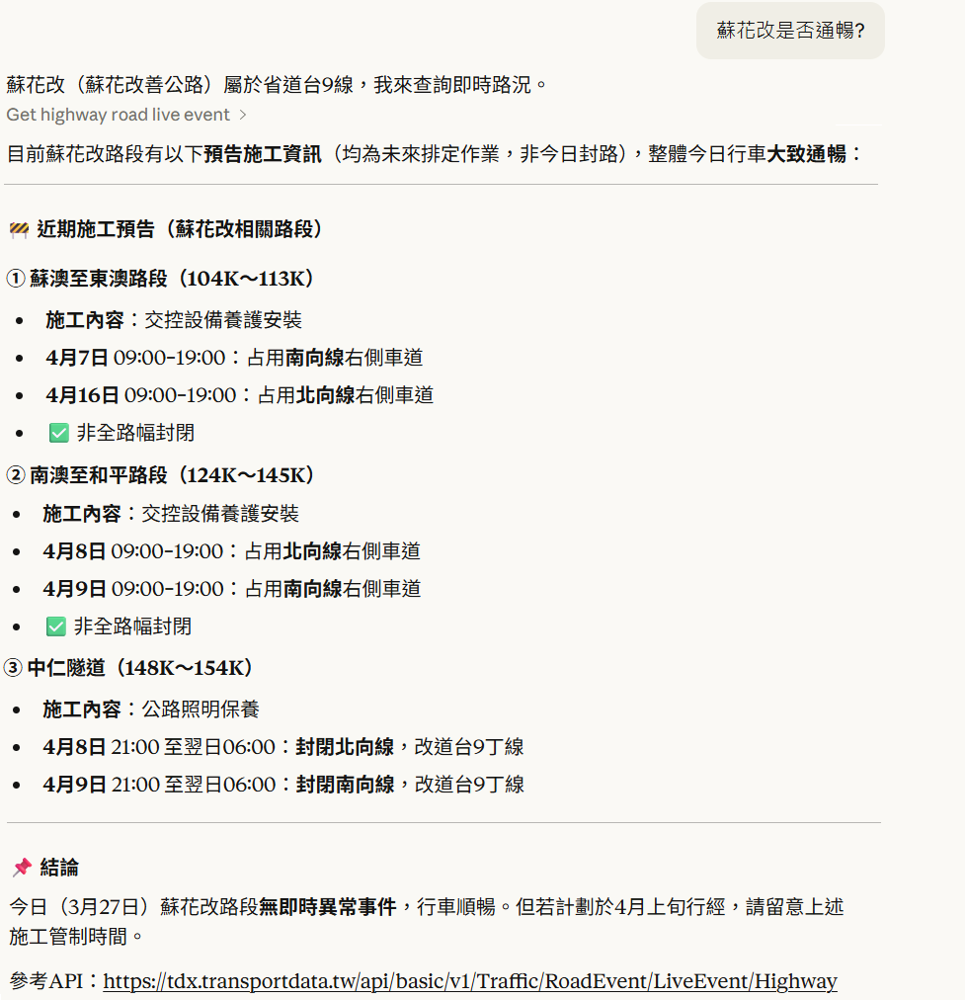
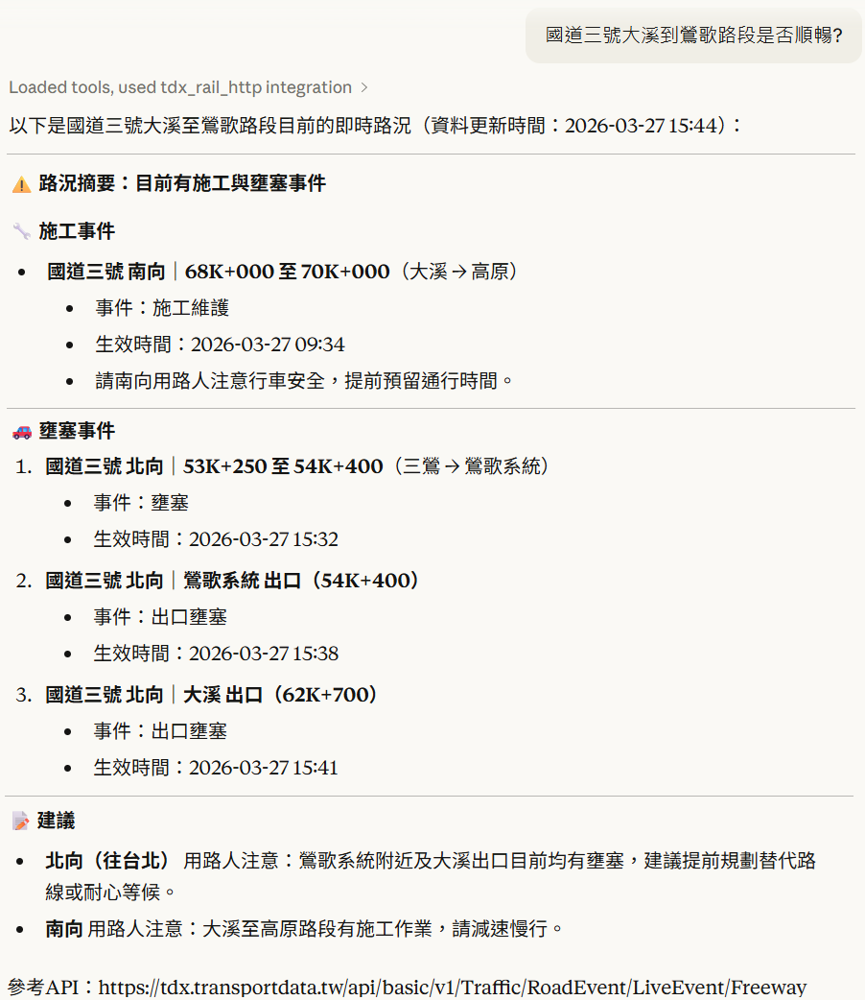

# TDX MCP-道路事件

TDX道路事件MCP服務，整合TDX平臺所提供的縣市道路事件、省道道路事件、高速公路事件API。本MCP 服務的重點並非在於直接對終端用戶提供應用服務，而是著重於驗證 TDX API 與資料已具備AI ready的開放性、標準化、機器易讀等特性，並能輕鬆與 AI 技術整合。

## 功能介紹

- 整合TDX道路事件API服務，提供查詢縣市道路、省道與高速公路道路事件。
- 使用Python開發符合MCP標準之服務。
- 相容於所有支援MCP的應用程式。
- TDX MCP服務執行於Server端，Client端透過HTTP連線至MCP服務。
- MCP服務使用會員帶入的API金鑰呼叫TDX API，並納入點數計算。
- 為了降低token使用量，僅回傳部分重要欄位資訊，且每次最多回傳5筆資料。

## 驗證環境

使用Claude Desktop 1.1.6046版本、Sonnet 4.6模型做MCP功能展示。所有回答內容皆由AI產生，難免會產生MCP工具使用時機誤判、回答錯誤訊息的情況，使用不同的MCP Client(如Cursor、Cline、VS Code等)與大語言模型也將產生不同的回應結果。

## 環境設定
請參閱[環境設定](https://github.com/tdxmotc/MCP?tab=readme-ov-file#%E7%92%B0%E5%A2%83%E8%A8%AD%E5%AE%9A)。修改道路事件MCP服務位址至以下連結:
```
https://tdx.transportdata.tw/tdx-mcp/event
```

## MCP使用範例-Claude Desktop

以下範例使用Claude Desktop 1.1.6046版本、Sonnet 4.6模型做展示。

> [!TIP]
> 使用其他Client端應用程式與模型可能產生不同的問答結果。

#### ➡️詢問「桃園慈文路附近是否有發生事情?」



#### ➡️詢問「蘇花改是否通暢?」



#### ➡️詢問「國道三號大溪到鶯歌路段是否順暢?」

