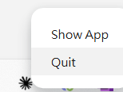
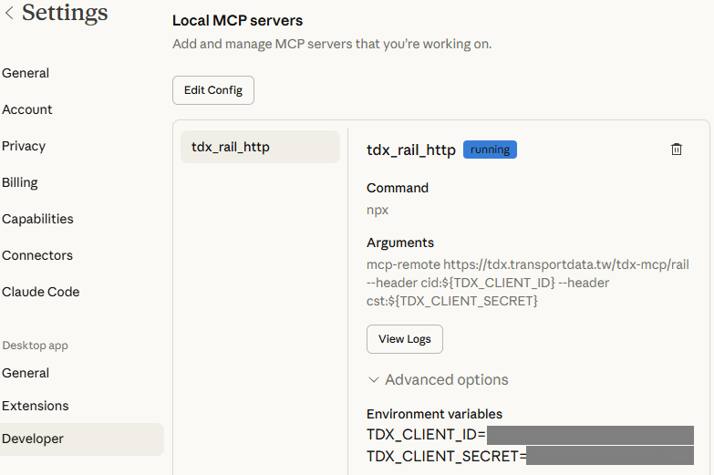
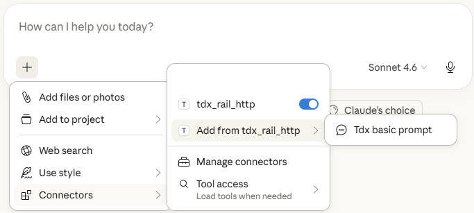
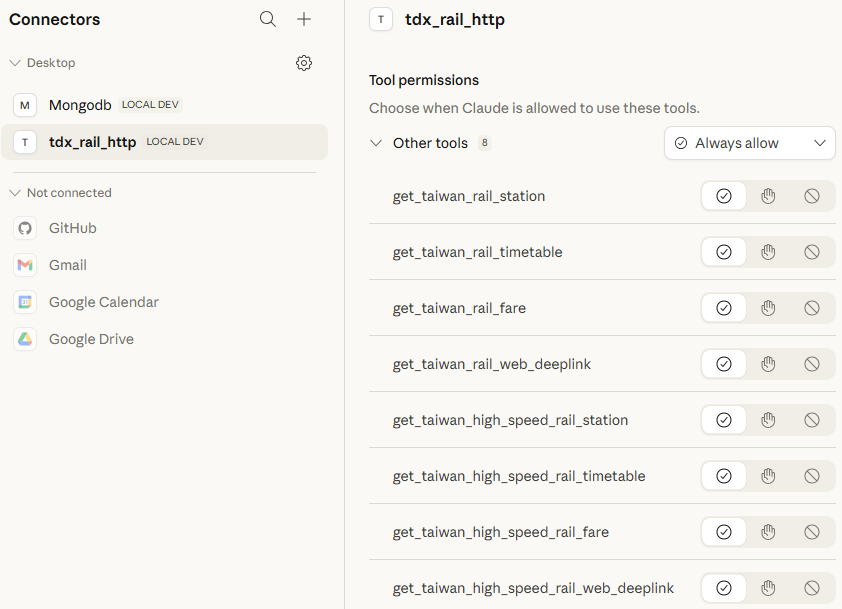
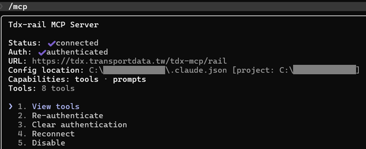

# TDX MCP服務
透過Model Context Protocol(MCP)標準介面提供AI工具與TDX資料服務之間的無縫整合，讓TDX會員能以自然語言與TDX平臺提供的資料做互動。

## 提供的MCP服務

### 臺鐵與高鐵
提供雙鐵班次查詢、票價查詢、網頁導訂票功能。
[點我觀看更多說明](https://github.com/tdxmotc/MCP/tree/main/Rail)。

### 道路事件
提供查詢縣市道路、省道與高速公路道路事件查詢。
[點我觀看更多說明](https://github.com/tdxmotc/MCP/tree/main/Event)。

## 使用方式

先至[TDX官網](https://tdx.transportdata.tw/register)註冊為TDX會員並取得API金鑰。在AI工具上的每次提問，MCP服務會自動使用會員提供的API金鑰呼叫一至多個相關聯的TDX API，每次的呼叫行為皆會計算點數。基礎會員(未訂閱)即可使用MCP服務，但使用量則視會員訂閱方案而訂。不同訂閱方案與TDX API呼叫量限制請參閱[TDX訂閱收費說明](https://tdx.transportdata.tw/pricing)。

TDX MCP服務放在伺服器端，不提供stdio方式存取，僅能透過HTTP存取TDX MCP服務URL。MCP服務會詳細記錄使用時間、使用端IP、會員API金鑰、被呼叫的MCP方法與參數，TDX維運團隊會定期檢視MCP服務使用紀錄，確保API資源不被濫用。

## 環境設定

以下以Claude Desktop和Claude Code為範例，說明如何引用TDX MCP服務:

### Claude Desktop
使用Claude Desktop 1.1.6046版本為例:
1. 確認本機電腦已安裝`npx` 。
2. 使用npm安裝`mcp-remote` 套件。

```
npm i mcp-remote
```
3. 開啟Claude Desktop MCP設定檔。

```markdown
%APPDATA%\Roaming\Claude\claude_desktop_config.json
```

4. 調整Claude設定檔，加入MCP服務運作設定。
此處以臺鐵與高鐵MCP服務為例，若使用其他運具MCP服務，請將MCP服務連結改為對應的位址:  

|運具|MCP服務URL|
| ------ | ------ |
|臺鐵與高鐵|`https://tdx.transportdata.tw/tdx-mcp/rail`|
|道路事件|`https://tdx.transportdata.tw/tdx-mcp/event`|


```markdown
{
  "mcpServers": {
    "tdx_rail_http": {
      "command": "npx",
      "args": [
        "mcp-remote",
        "https://tdx.transportdata.tw/tdx-mcp/rail",
        "--header",
        "cid:${TDX_CLIENT_ID}",
        "--header",
        "cst:${TDX_CLIENT_SECRET}"
      ],
      "env": {
        "TDX_CLIENT_ID": "{TDX會員CLIENT_ID}",
        "TDX_CLIENT_SECRET": "{TDX會員CLIENT_SECRET}"
      }
    }
  }
}
```

5. 若Claude Desktop應用程式在修改設定檔之前已經開啟，則需在設定檔調整完之後至桌面右下角點選Claude Desktop圖示，右鍵選擇Quit完整關閉Claude Desktop並重新開啟應用程式。

> [!TIP]
> 請務完整退出Claude Desktop並重啟，若只單純關閉Claude Desktop視窗則無法正確載入MCP工具。



6. 重啟Claude Desktop後，開啟Settings→Developer，確認成功引入tdx_rail_http服務且狀態為running，並確認TDX API金鑰(TDX_CLIENT_ID和TDX_CLIENT_SECRET)資訊是否正確。



7. 回到提問視窗，點選左下角「+」圖示→Connector→Add from tdx_rail→挑選Tdx basic prompt，視需求使用預先定義好的Prompt，並確認tdx_rail_http為開啟狀態。



8. 點選「Manage connectors」，開啟Connectors設定，點選「tdx_rail_http」的Configure按鈕。確認所有MCP工具的狀態為「Always allow」或「Needs approval」。



### Claude Code
使用Claude Code 2.1.80版本、載入TDX雙鐵MCP工具為例:
1. 安裝Claude Code
2. 加入TDX MCP工具
```
claude mcp add --transport http tdx-rail https://tdx.transportdata.tw/tdx-mcp/rail --header "cid:{TDX_CLIENT_ID}" --header "cst:{TDX_CLIENT_SECRET}"
```
3. 確認成功引入TDX MCP工具
```
claude /mcp
```
