# TDX MCP-臺鐵與高鐵

TDX臺鐵與高鐵MCP服務，整合TDX平臺所提供的臺鐵與高鐵查詢車次、票價與導訂票等API。本MCP 服務的重點並非在於直接對終端用戶提供應用服務，而是著重於驗證 TDX API 與資料已具備AI ready的開放性、標準化、機器易讀等特性，並能輕鬆與 AI 技術整合。

## 功能介紹

- 整合TDX臺鐵與高鐵API服務，提供查詢車次、票價與導訂票。
- 使用Python開發符合MCP標準之服務。
- 相容於所有支援MCP的應用程式。
- TDX MCP服務執行於Server端，Client端透過HTTP連線至MCP服務。
- MCP服務使用會員帶入的API金鑰呼叫TDX API，並納入點數計算。
- 為了降低token使用量，僅回傳部分重要欄位資訊，且每次最多回傳3筆資料。


## 申請開通服務存取權限

> [!TIP]
> 需先至TDX會員中心申請`臺鐵訂票導訂`或`高鐵訂票導訂`服務存取權限，審核通過後才能正常使用臺鐵與高鐵導訂票MCP服務。
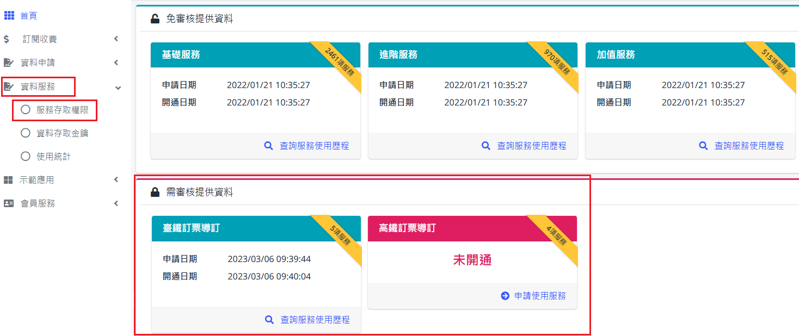

## 驗證環境

使用Claude Desktop 1.1.6046版本、Sonnet 4.6模型做MCP功能展示。所有回答內容皆由AI產生，難免會產生MCP工具使用時機誤判、回答錯誤訊息的情況，使用不同的MCP Client(如Cursor、Cline、VS Code等)與大語言模型也將產生不同的回應結果。

## 環境設定
請參閱[環境設定](https://github.com/tdxmotc/MCP?tab=readme-ov-file#%E7%92%B0%E5%A2%83%E8%A8%AD%E5%AE%9A)。修改臺鐵與高鐵MCP服務位址至以下連結:
```
https://tdx.transportdata.tw/tdx-mcp/rail
```
## MCP使用範例-Claude Desktop

以下範例使用Claude Desktop 1.1.6046版本、Sonnet 4.6模型做展示。

> [!TIP]
> 使用其他Client端應用程式與模型可能產生不同的問答結果。

#### ➡️詢問「明天19:00從板橋到桃園的臺鐵列車」

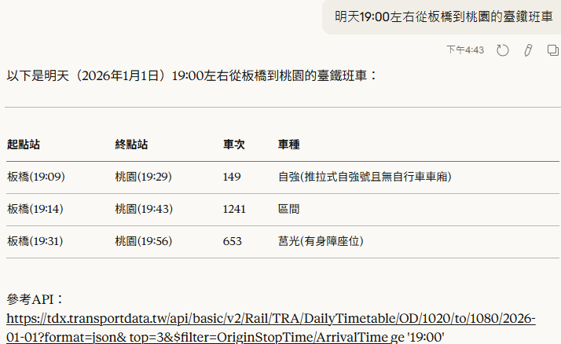

#### ➡️進一步詢問指定車次的票價

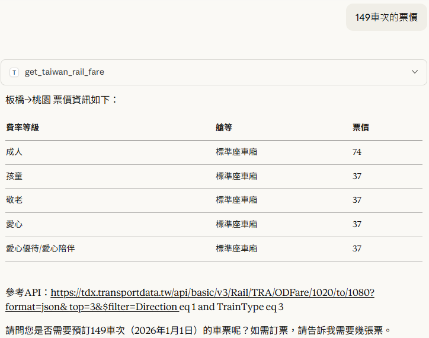

#### ➡️進一步產生指訂車次與車票數的訂票連結(具時效性)

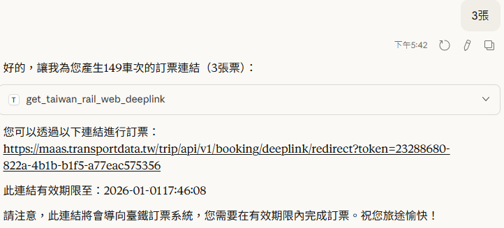

#### ➡️點選導訂連結後，開啟臺鐵訂票網站，並自動帶入指定的日期、起訖站、車次與票數

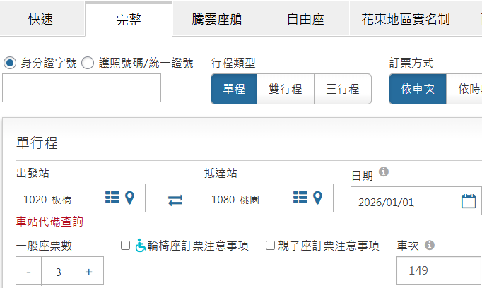

#### ➡️詢問「明天09:00從桃園到左營高鐵」

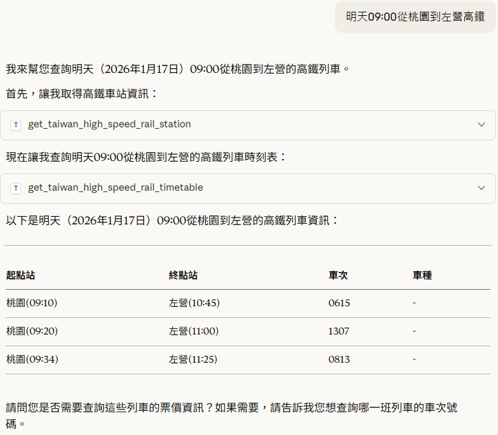

#### ➡️進一步詢問指定車次的票價

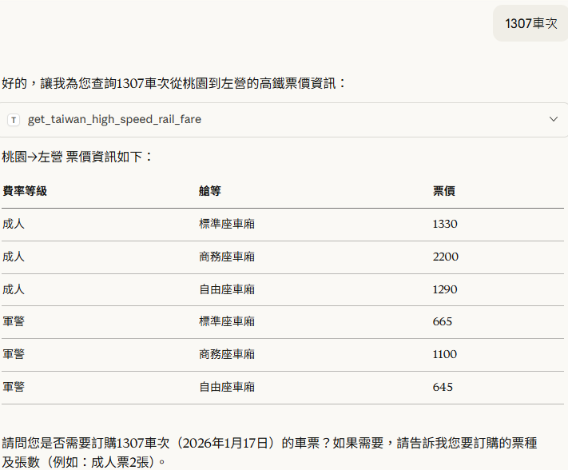

#### ➡️進一產生指定車次、車廂類型、票數的訂票連結(具時效性)

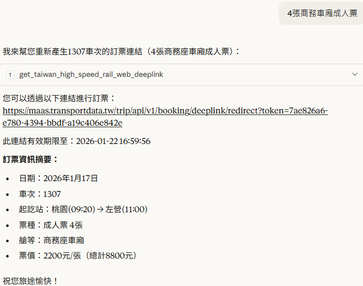

#### ➡️點選導訂連結後，開啟高鐵訂票網站，並自動帶入指定的日期、起訖站、車次、車廂類型與票數

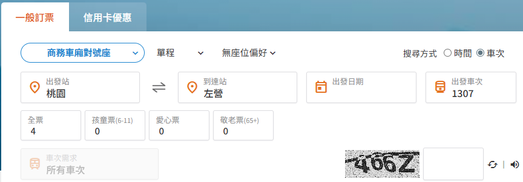

## MCP使用範例-Claude Code

以下範例使用Claude Code 2.1.80版本、Sonnet 4.6模型做展示。

#### ➡️詢問「今天19:00板橋到桃園的火車」
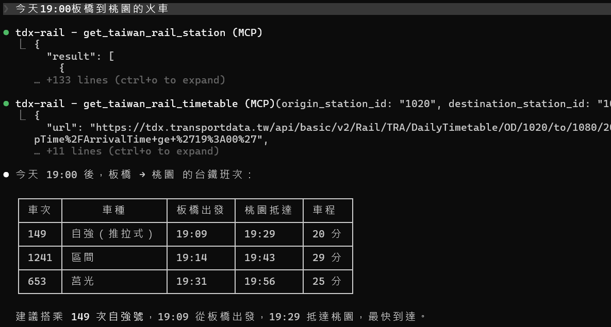

#### ➡️詢問「149自強號票價」
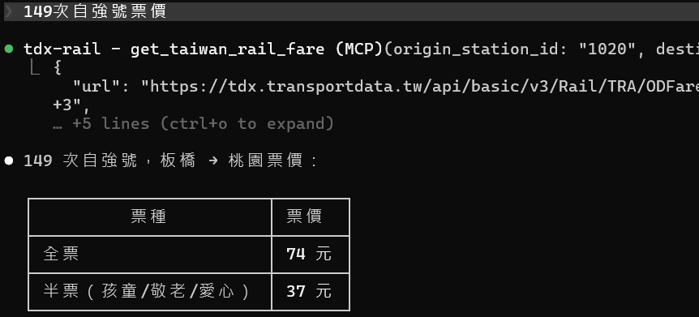

#### ➡️詢問「訂購149次列車兩張成人票」
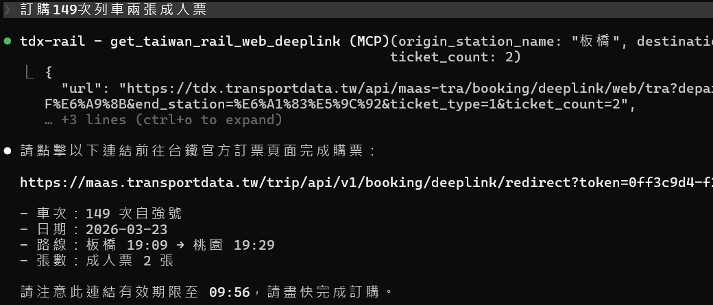